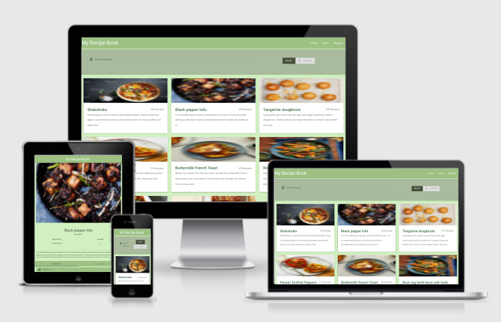

# Milestone Project Three / My Recipe Book

[View the live project here](https://my-recipe-book-matt.herokuapp.com/)

## Contents

- [User Expreience](#user-experience)

  - [User Stories](#user-stories)
  - [Owner Goals](#owner-goals)
  - [Design](#design)

- [Features](#features)
   
  - [Current Features](#current-features)
  - [Features which I want to implement in the future](#Features-which-I-want-to-implement-in-the-future)

- [Technologies Used](#technologies-used)

- [Testing](#testing)
  - [Lighthouse Testing](#lighthouse-testing)
  - [HTML and CSS Testing](#html-and-css-testing)
  - [Known Bugs](#known-bugs)

- [Deployment](#deployment)

- [Credits](credits)

## User Experience

### User Stories

- **First Time Visitor Goals**

1. As a first time visitor, I want to easily understand the main purpose of the site.
2. As a first time visitor, I want to easily navigate through the site.
3. As a first time visitor, I want to be able to view other peoples recipes.
4.  As a first time visitor, I want to be able to search for existing recipes.
5.  As a first time visitor, I want to be able to register an account easily.

- **Returning Visitor Goals**

1.  As a returning visitor, I want to be able to view other peoples recipes.
2.  As a returning visitor, I want to be able to add my own recipes to the site.
3.  As a returning visitor, I want to be able to edit and delete my own recipes
4.  As a returning visitor, I want to be able to follow the site through social links

- **Admin Goals**

1. As an admin I would like full access to all pages
2. As an admin I would like to be able to remove any recipe from the site.

- **Site Goals**
1. I want the site to be attractive, responsive and easy to navigate for the user.
2. I want users to be able to add their own recipes to the site. 

## Design 

- ### Color Scheme

I wanted to choose a fairly minimal color scheme for this project as there would be pictures uploaded to the site via URL from the user.  Not knowing what these pictures would be I kept the colours minimal as to try and avoid clashing.
The colours used were based off of the colour sage #9DC183 to tie in with the food theme. 

- ### Fonts

All text is rendered in Roboto as it is easy to read and widely used. Giving the site a sense of familiarity to new users. This was obtained from Google Fonts. 

- ### Layout 

The site is designed to work and be used on various screen sizes with the layout changing responsively thanks to Materializecss.

- ### Wireframes

I made my wireframes using Balsamiq. I didn't make a wireframe for each individual page as I knew that there was going to be quite a lot of crossover in the layout of each of the pages. There were a few changes to the wireframes during development. 

- Recipes
[Mobile](assets/images/recipes-small.png)
[Tablet](assets/images/recipes-med.png)
[Web](assets/images/recipes-large.png)

- Add recipe
[Mobile](assets/images/add-recipe-small.png)
[Tablet](assets/images/add-recipe-med.png)
[Web](assets/images/add-recipe-large.png)

## Features

### Current Features

### Login / Register
- When the user wants to make an acount then they are prompted to enter their password twice and the form will not submit unless they are the same
- When logging in they will need to use the correct username and password. if not correct an error message will flash on the screen

### Recipes Page
- At the top of the page there is a search functionality that will search the recipe name and also the recipe description for any keyword that the user searches.

### Profile Page
- While the user is logged in they can access their profile page where it displays their name and also any recipes that they have uploaded to the site.

### Add Recipe
- When a user is logged in they can access the add recipe page. 
- When the user inputs a URL for the recipe image the image automatically updates and shows a preview of the image.

### Edit Recipe
- If the recipe author is the user then they will have the option to edit the recipe
- On this page there is also the function to delete the recipe which will prompt a message asking "are you sure?"

### Admin
- The admin can go to the manage cuisines page where they can add, edit and delete any other cuisines that they might want to add.
- They can also delete or edit any recipe that any users add to the database.
   
 
### Features which I want to implement in the future

- Changing the image upload so that you can upload an actual image instead of imputing a URL
- Adding a comments section to each of the recipe pages
- Adding a rating section for each of the recipes
- Adding a seperate page where you can save other users recipes.
- Adding a conversion rate for the ingredient measurements 
eg. from grams to cups.

## Technologies Used

### Languages and Libraries Used
1. [HTML5](https://en.wikipedia.org/wiki/HTML5)
2. [CSS3](https://en.wikipedia.org/wiki/CSS)
3. [JS](https://en.wikipedia.org/wiki/JavaScript)
4. [Materialize](https://materializecss.com/) was used for the responsive layout of the site and the initial styling.
5. [MongoDB](https://cloud.mongodb.com) was used to store the database.
6. [Jinja](https://palletsprojects.com/p/jinja/) was used as a tmplating language throughout the site
7. [Google Fonts](https://fonts.google.com/) was used throughout the site to import the Roboto fonts.
8. [jQuery](https://jquery.com/)
Was used as a JavaScript library to speed up the writing of JavaScript.
9. [Font Awesome](https://fontawesome.com/) Was used for the logos of the social media links through the site.

### IDE and Version Control

1. [Git](https://git-scm.com/)

Git was used as a version control software

2. [GitHub](https://github.com/)

GitHub was used as a remote repository where I pushed commits to. 
GitHub was also used to deploy the site throuhg GitHub pages.

3. [GitPod](https://www.gitpod.io/)

GitPod was used as a text editor that I used to write some of my HTML, CSS and JavaScript.  I stopped using this after the first few days of the project as I can't seem to get along with it. 

### Design 

1. [Balsamiq](https://balsamiq.com/)

I used Balsamiq to designa and draw my wireframes before coding the project.

2. [Chrome Devtools](https://developer.chrome.com/docs/devtools/)

Chrome Devtools was used throughout the process helping style the site and help fix any bugs which I found.

3. [Am I Responsive](http://ami.responsivedesign.is/)
Was used for the the Image at the top of the repository.

## Testing

At the time of testing the W3 validator website is down so I have not included testing and validation for my html and css.

### Lighthouse Testing
All the scores in lighthouse are testing fairly high apart from the best practices.  The reason that best practices are being pulled down is because of the images shown on the recipe cards. As all of the img src are urls I can't fix this at this time but in the future when I would like the user to upload the actual image file rather thatn provide a url this will be addressed.

### Pep8 Validation
-To test my python code I used the [pep8 validator](http://pep8online.com/)

### Known Bugs
- There is still some styling from MaterializeCSS that is coming through. as when you hover on certain elements or select certain form elements.  I have been trying to fix this with no luck so far and will continue to look into it in the future. 

### Deployment

- Creation 

I first created this repository by doing the following.

1. Logging into GitHub and clicking the green New button in the top right corner of the screen.
2. I then created a new repository using the Code Institute-Org/gitpod-full-template and used the repository name MyRecipeBook I then clicked create repository.
3.I had the Gitpod chrome plugin downloaded so I clicked the green Gitpod button on the repository where I could start to write code for the site.

### Forking the Repository

To fork the repository to contribute to the project you can do the following.
1. Log in to GitHub and open the MyRecipeBook repository.
2. At the top right hand side of the page underneath your profile there is a fork symbol.
3. Once you have clicked this the repository will be forked.

### Cloning the Repository

If you wish to clone the repository you can do the following.
1. Go to [My account](https://github.com/matthewelstone) and sellect the MyRecipeBook repository.
2. Next to the GitPod button (if you have GitPod installed) or in the top right click the code button.
3. Click download zip.
4. You can then open the repository with your chosen code editor.

### Create A MongoDB Database

A MongoDB Account is required for this.

1. Create a new database in MongoDB
2. Create collections for users, recipes, types and cuisines

### Environment Variables 

1. Create your env.py file which will contain sensitive information. Because of this add it to your .gitignore file. 
2. Within your env.py file
  - enter your Mongo_URI found within the 'connect' section of the cluster page.
  - set your IP and PORT
  - Create a secret key using [RandomKeygen](https://randomkeygen.com/)

### Heroku Deployment
A Heroku account is required for this.

1. Create a new app within Heroku.
2. Choose an original name for the app.
3. Within the deployment tab  select GitHub and link with your GitHub repository.
4. In settings reveal your config vars.
5. Add all the of the same environment variables as in the env.py file.
6. Within Deploy select enable Automatic deploys. Below this you can select which branch you would like to deploy.
7. Click this to open the App.

### Credits

- [Materialize](https://materializecss.com/) was used for the structure and layout of the site.
- [Stackoverflow](https://stackoverflow.com/) was used to help find solutions to issues whilst building the project.
- [BBCFood](https://www.bbc.co.uk/food) [OliveMagazine](https://www.olivemagazine.com/) [YotamOttolenghi](https://ottolenghi.co.uk/recipes) were used for the recipes on the site.
- [Code Institute](https://learn.codeinstitute.net/login?next=/) mini task project was used as a starting point for the project to help functionality.